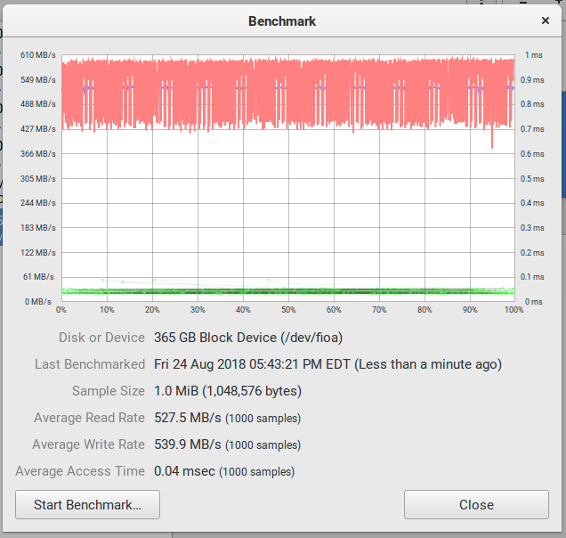
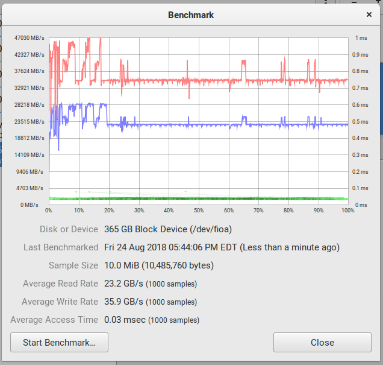
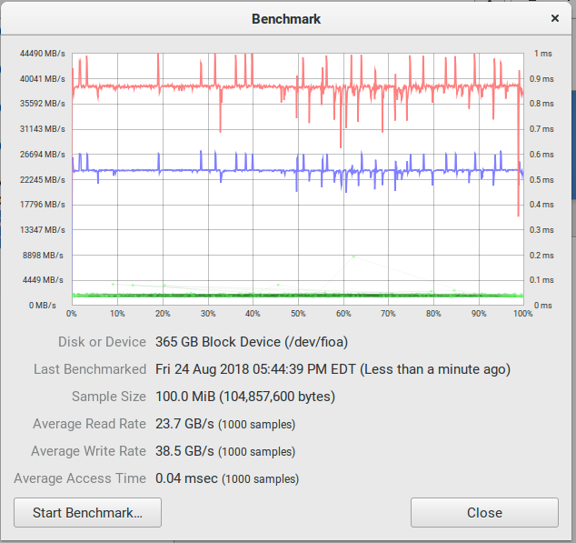
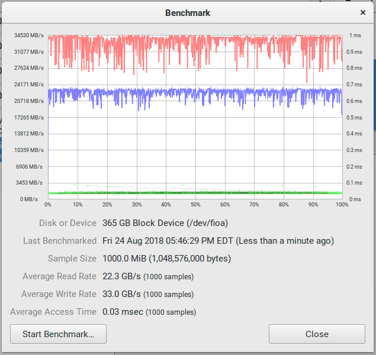

# ioFusion ioDrive Ubuntu Installer

Installs the required bin tools and gets snuf's VSL drivers and installs them.

## Usage

  git clone git@github.com:pjobson/ioDriveUbuntu.git
  cd ioDriveUbuntu
  ./ubuntu_installer.sh

I made this to copy to a machine without git:

* Installs git
* Installs fio-util
* Clones snuf's iomemory-vsl
* Compiles and installs driver.
* Shows the status.

From here I use parted to set it up as I would a normal drive.

### FIO Tools

To show the available tools you can do:

  ./fioToolInfo.sh

## Benchmarks

### 1 MiB @ 1000 Samples

* Read: 527.5 MB/s
* Write: 539.9 MB/s

### 10 MiB @ 1000 Samples

* Read: 23.2 GB/s
* Write 35.9 GB/s

### 100 MiB @ 1000 Samples

* Read: 23.7 GB/s
* Write 38.5 GB/s

### 1000 MiB @ 1000 Samples

* Read: 22.3 GB/s
* Write 33.0 GB/s

